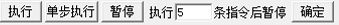
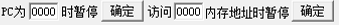
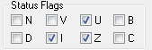
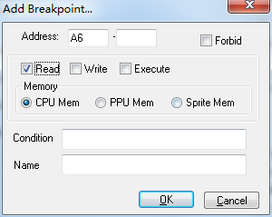
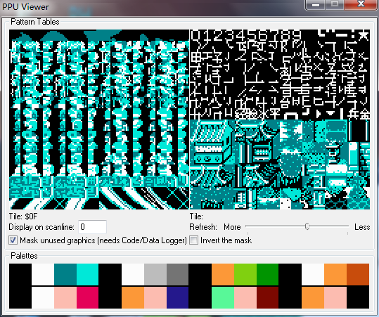
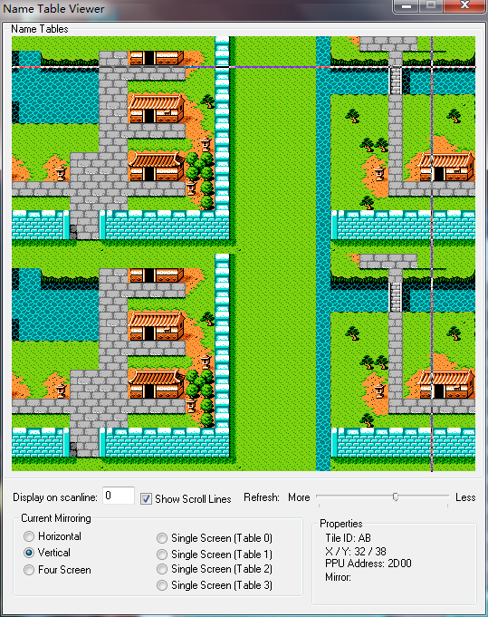
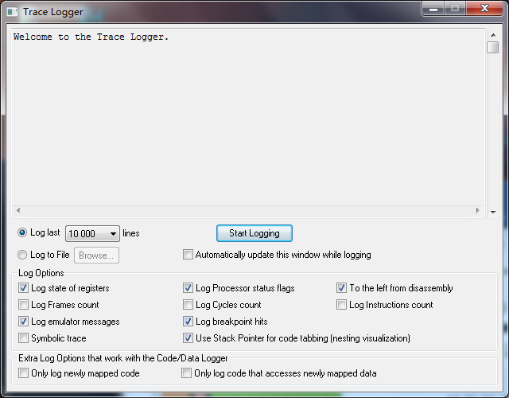
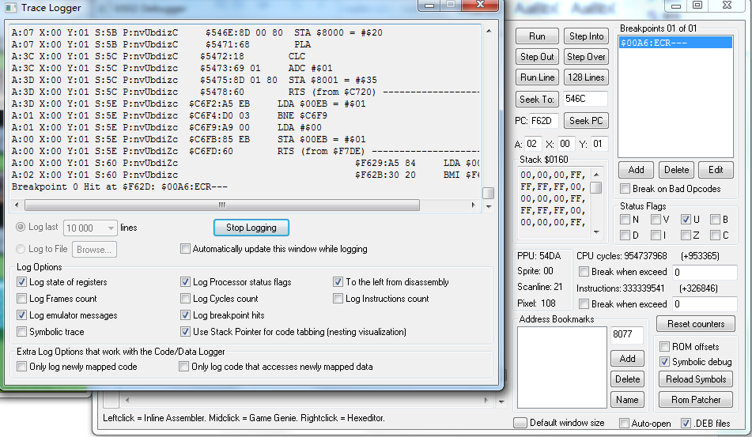

# 神琴的吞食天地修改教程 前置章

### 吞食天地的ROM与RAM分析

#### RAM:

- Ram只有64KB
- 能访问的地址\$0000-\$ffff
- 以下内容来自任天堂产品系统文件 配合NTS2R实质修改

|开始地址 | 用途 | 结束地址 |
|--|--|--|
|$0000 | 2K字节RAM，做4次镜象（即$0000-$07FF可用) | $1FFF| 
|$2000 | 寄存器 | $2007 |
|$2008 | 寄存器（$2000-$2008的镜像，每8个字节镜像一次） | $3FFF |
|$4000 | 寄存器 | $401F | 
|$4020 | 扩展ROM (NTS2R不可用区域) | $4FFF | 
|$5000 | 扩展ROM (NTS2R 可用扩展区域) | $5FFF |
|$6000 | 卡带的SRAM（需要有电池支持） | $7FFF|
|$8000 | 可活动映射的区域(切页rom主要修改这个区域) | $BFFF | 
|$C000 | 驻留体ROM(直接映射FC010-10000F) | $FFFF|

##### 以上内容是内存分布

- 例如捉将 
- 你先切页执行在8000内存中 
- 但是捉将的程序不再内存中 
- 你去执行程序必然遭到错误

##### 内存表是非常有用的 有了相关内存可以很便捷的下断点

#### ROM:

- ROM主要介绍怎么映射到RAM的\$8000-\$bfff中
- 我们称ROM里的地址是物理地址 RAM里的地址是逻辑地址
    - 公式: (十六进制运算)
    - 页码=(物理地址-10)/4000x2
    - 对应逻辑地址=(物理地址-10)/4000的余数+8000
    - 给出一个实际地址 例如7e010
    - 页码=3E 逻辑地址=a000
    - (相关运算可以使用系统自带计算器 找到选项程序员就可使用十六进制计算)

### 首先 我们要介绍6502CPU相关的东西

#### 毫无诚意抄袭6502大奥秘

|寄存器|解释|注释|
|--|--|--|
|累加寄存器 A|这是个8位寄存器,既然是8位,那么说明该寄存器中只能存储一个(00-FF)之间的立即数. 它与算术逻辑运算单元一起完成各种算术逻辑运算,它既可存放操作前的初始数据,也可存放操作结果,所以称为累加器.|在6502汇编中,这个寄存器应该算是用的最多的 大家也不要管那么多,只要知道有这个寄存器,该寄存器可以存放一个00-FF之间的立即数就可以了.|
|变址寄存器 X|也是8位寄存器,它在编程中常被当作一个计数器来使用.它可以由指令控制而被置成一个常数并能方便的用加 1,减 1,比较操作来修改和测试其内容,以使得程序能够方便灵活的处理数据块,表格等问题.| |
|变址寄存器 Y|用法和变址寄存器 X一样,只不过在有些情况下,比如程序中要同时处理两个以上的数据块时,一个变址寄存器显得不够,所以6502中有两个用于变址的寄存器 X和Y.| |
|程序计数器 PC|它是6502中唯一的16位寄存器,PC是用来存放指令地址码的寄存器,由于程序的执行一般为顺序执行方式,每取出一个指令字节后PC即自动加1,为取下一个指令字节做好准备,所以程序计数器PC中的内容往往是指向下一个指令字节地址,但在执行转移指令时,PC中将被放进要转移的目标地址.| |
|堆栈指针 S|它是用来指示堆栈栈顶位置的寄存器,由于6502规定堆栈设在 第 1 页存储器中,所以堆栈指针 S 也是8位寄存器只用来指出堆栈位置的低 8 位 地址.S 具有数据进栈时自动减 1,出栈时自动加 1的功能.(栈结构占用内存$0100-$01ff)| |
|标志寄存器 P|这也是 8位的寄存器,但是只用了其中的 7 位,第 5 位空着不用. 每条指令在执行之后往往会发生进位溢出,结果为 0,或是结果为 负数(大于 7F的数叫负数)的情况.指令执行完后常常要保留这些情况作为条件分支的依据,标志寄存器P就是为了适应这需要而设计的,在寄存器P中有以下7个标志位,不过我这里只介绍其中的 5 位| |

|位置|7|6|5|4|3|2|1|0|
|--|--|--|--|--|--|--|--|--| 
|标志|N|V| |B|D|I|Z|C|

|标志|作用|
|--|--|
|C 进位标志 | 指令执行完毕后的最高进位状态,若最高位有进位则使 C = 1,若最高位无进位则使 C = 0 |
|Z 零标志 | 指令执行完毕后结果为0,那么 Z = 1;否则 Z = 0 |
|I 中断标志 | 此位置 0 表示允许中断,置 1 表示禁止中断,但非屏蔽中断不受次约束 |
|V 溢出标志 | 指令执行后若产生溢出,则次标志位被置 1 |
|N 负数标志 | 指令执行完毕后,若结果最高位 为1,则该位置 1 |

#### 指令相关的等以后在解释 以上内容对于介绍模拟器有重要意义 如果下面看不懂 翻上来看看

### 模拟器功能介绍:

#### Virtuanes_Debug版(非debug版无意义)

右面的debug模块显示如上
先介绍这个:

- 当你想debug的时候 一开始暂停是有一定用处的
  - 重置游戏 会直接暂停 因为游戏重置就会寻址reset向量 然后开始执行
  - 这个对找reset向量有帮助 例如NTS2R就是修改了reset初始化代码
  - 才顺利的扩展的$5000-$5fff相关内存
- 停止刷新对于已经停止(因为符合断点条件)有用
  - Debug界面是一直在刷新 所以需要点停止刷新静止下来

- 执行:暂停下来之后点 可以让游戏继续运行
- 单步执行:让模拟器执行下一条指令(单步调试分析)
- 暂停:让游戏暂停下来
- 后面的执行X条指令后暂停 就是单步执行x X步 确定是修改X值

- PC程序计数器 表示执行到某个逻辑地址让其暂停
- 后面的是 访问某个内存地址 例如A6是作弊地址 有程序必然去访问A6
- 你想知道是哪段程序访问 可以写00A6 确定 就知道哪段程序访问A6

俗称注释断点 注释内容自己摸索(我不用这个模拟器 但是这模拟器能調一些BUG)

|寄存器|作用|
|--|--|
|PC|程序计数器|
|A|累加寄存器A|
|X|变址寄存器X|
|Y|变址寄存器Y|
|SP|堆栈指针(stack point)|
|P|标志寄存器|
|N0|表示N标志值为0 N1:表示值为1 以此类推|

每个标志只能0/1 用来判断分支 选项之类的

|名称|作用|
|--|--|
|地址|逻辑地址 也就是PC|
|16进制码|就是对应机器码|
|ASM指令|机器码对应的汇编指令|
|注释|这个是张晓波制作模拟器时候写的东西 符合国人的中文断点 程序翻译|

#### 举个使用例子:

`下断点A6`

可以看到 $F62D访问了A6 被暂停下来了
这样就可以慢慢debug了

- 以上是debug模块
- RAM模块可以直接修改内存 配合debug调试
- VRAM模块 图案 背景 精灵都是关于图像类调试
- 由于我不太会用 就不详述了

### 下面介绍FCEUX-2.2.2

Debug界面如上

这个就是调试区的功能按钮

|命令|功能|
|--|--|
|Run|运行| 
|Step Into|单步运行|
|Step Out|步出(jsr这种跳转就是跳到下一层 不关系这层的话 可以跳出)|
|Step Over|步跃(jsr这种跳转可以直接运行完跳回来)|
|Run Line|行跃(具体我没用过)|
|128 Lines|我也没用过|
|Seek To|直接跳到后面所示逻辑地址|
|PC|程序计数器(不要随意修改 除非你明白你在做什么)|
|Seek PC|跳到PC所示地址|

| |说明|
|--|--|
|A|累加寄存器 A |
|X|变址寄存器 X |
|Y|变址寄存器 Y |
|Stack|堆栈指针(stack point)(下面是栈内容)|

这个是标志P 对勾代表标志为1 没有代表0

这个是断点区 下面Break on Bad Opcodes是坏码中断
改程序的时候 容易出现坏码 可以运行到坏码就暂停
配合Trace Logger(日志)非常容易追踪
后面会详述日志用法

| |功能|
|--|--|
|Add|添加断点条件|
|Address|是逻辑地址 可以是区域|
|Read|是对上面地址操作读|
|Write|是写|
|Execute|是执行|
|Memory|选项是在哪个区域 有三个区域 CPU PPU(等同于图案) 精灵|
|Condition|是条件 以后慢慢讲|
|Name|是标识 给自己看的|

#### 拿A6举例

读操作
 

也断下来了 $F62D 同理
其他功能请自行探索

#### PPU Viewer 实质就是图案

#### Name Table Viewer

PPU地址图案 对应VRAM

#### Hex Editor(默认是RAM)

View可以修改是NES memory和PPU memory(对应ram和vram) Romfile是游戏文件

- 可以直接像上面那个RAM 直接修改
- 右单击可冻结(锁定)数值 加断点等功能 不详述
- 其他的多摸索 file里有个 goto address 直接跳到目标地址

#### Trace Logger

这个一般做实在无法判断错误 拿出执行日志分析

开始调试日志的话 先点start logging
游戏速度会放缓 很正常 我们还拿a6举例子

- 上面执行日志详述了到断点之前的运行过程
- AXY是寄存器 S是stack P是标志 后面是执行内容
- Breakpoint 显示断点停止

#### 谢谢观赏
 

