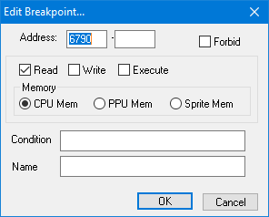
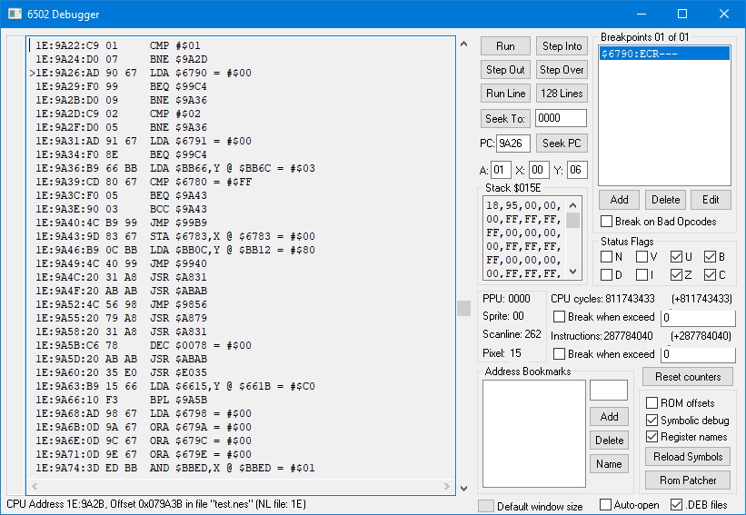
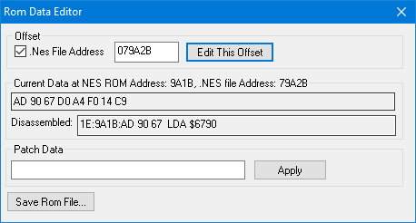
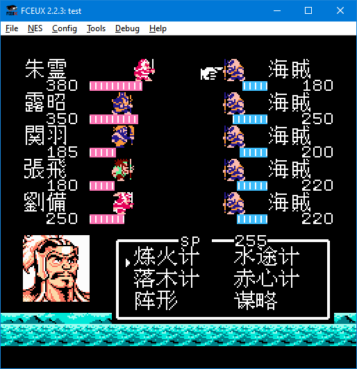

# 神琴的吞食天地修改教程 解除计策地形限制

### 分析

吞食天地使用了SRAM的地址保存是否能在当前地形使用某种计策

以下情报来源于 173氏的网站

|地址|数值|作用|
|--|--|--|
|$6790|01|水計,背水陣使用可能 火計使用不可 （zzzさんの提供情報）|
|$6791|01|撃石計使用可能（zzzさんの提供情報）|

所以我们在`$6790`下读取断点



然后我们在陆地上使用水途计

然后就断点触发了



```
 1E:9A1B:AD 90 67  LDA $6790 = #$00
 1E:9A1E:D0 A4     BNE $99C4
 1E:9A20:F0 14     BEQ $9A36
 1E:9A22:C9 01     CMP #$01
 1E:9A24:D0 07     BNE $9A2D
>1E:9A26:AD 90 67  LDA $6790 = #$00
 1E:9A29:F0 99     BEQ $99C4
```

勾选ROM offset(就是rom地址) 就可以知道需要patch哪里

经过测试 火计策触发地址是`079A2B` 水计策触发地址是`079A36`

为了测试 我们使用FCEUX的Rom Patcher功能



然后对这两个地址写5个EA(EA是NOP 无操作 对rom无影响)

结果



同理对石系计策地址`$6791`下断点

```
>1E:9A31:AD 91 67  LDA $6791 = #$00
 1E:9A34:F0 8E     BEQ $99C4
```

得到地址`079A41`

对这个地址同样进项patch操作 发现也可以使用

然后就可以使用十六进制编辑器以下地址进行5个EA填充

|地址|作用|
|--|--|
|`079A2B`|火系计策判定地址|
|`079A36`|水系计策判定地址|
|`079A41`|石系计策判定地址|

### 题外：

我们还可以反向思路，确认哪些程序修改了这些判定地址达到一切奇妙玩法的实现