# 关于自制四字武将名字模

## 作者：小桥
首先用编辑器打开任意吞食2ROM

选择希望使用的字体及字号（Windows 宋体 16号  最接近原版rom字体），如下图

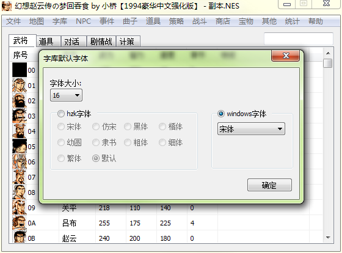

选择好后点【确定】按钮

然后打开编辑器【字库】--【战斗字库】   （选择对话字库也一样效果，只是为了获得编辑器导出的字模）

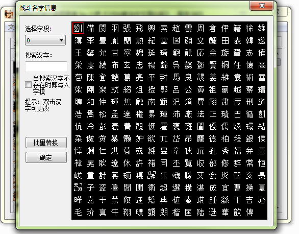
 
然后双击任意文字，依次输入想要的文字，比如：无双胃炎（这里我双击了【刘】字）

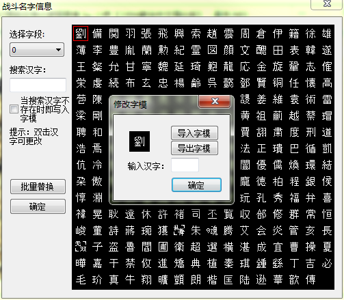

输入【无】

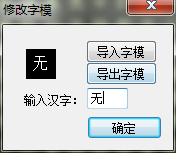

点击【导出字模】，比如导出到【桌面】（导出位置无所谓，方便找到即可）

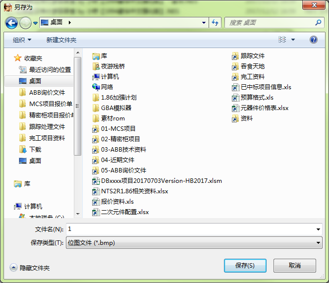

给导出的字模命名下，比如1.bmp    2.bmp    （命名无所谓，方面自己识别即可，也可以按文字命名为：无.bmp）

依次导出后面的文字

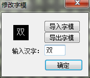 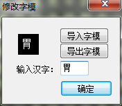 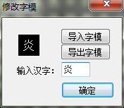

然后可以关闭编辑器了

去桌面找到刚刚导出的4个字模

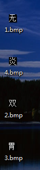

使用画图编辑 【无】字模
 
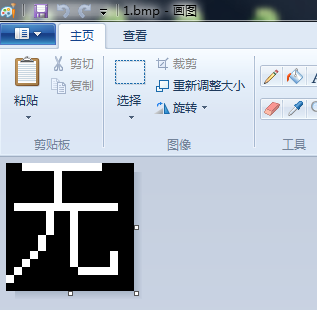

将其他三个字模复制到该字模内，首先将【无】字模画布拉宽一点
 
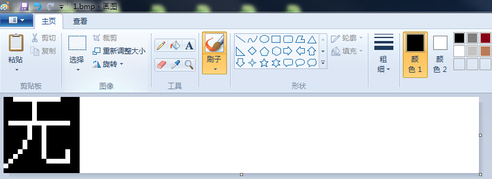

然后依次将其他的字模复制进来（可以打开多个画图窗口来复制~）
 
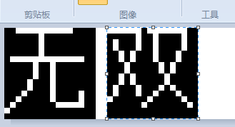
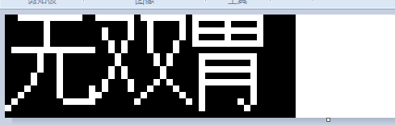
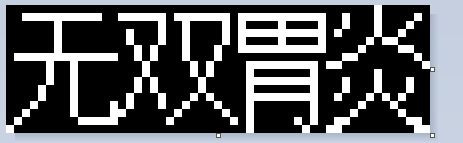

这里最好尽可能压缩宽度，方便提高后面整体压缩后的显示效果
在画图窗口可以查看当前画布尺寸

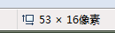

到目前为止，先保存一下画图

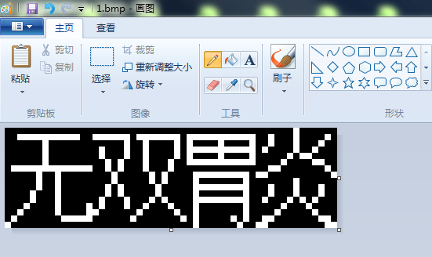

然后点击画图的【重新调整大小】

将该页设置如下（水平像素为48，去除保持纵横比的勾）：

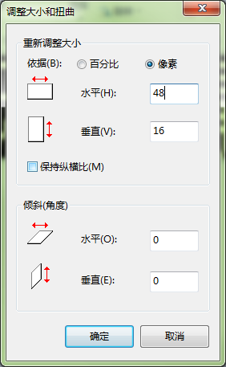

确定

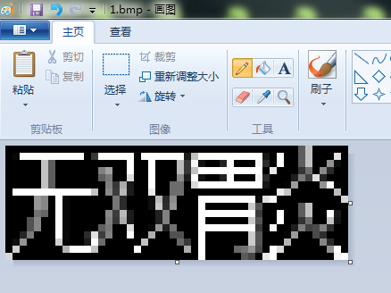

文字被压缩后显示效果有些下降，这时候就需要手动去点点点了，将显示效果【手动】调整为满意为止

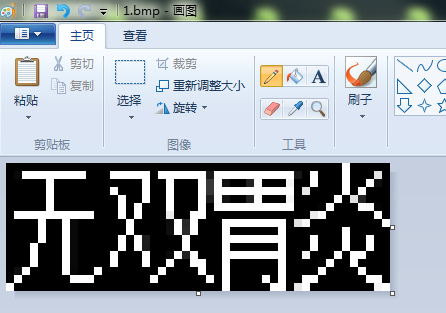

然后保存当前为止的修改内容。

到桌面将修改好的字模复制2份出来
 
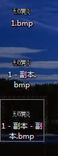

然后开始分割修改好的字模，任意打开其中一个

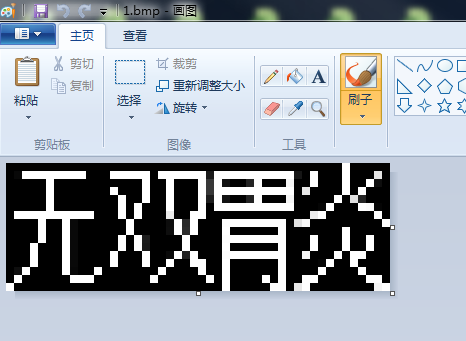

【手动】滑动画布，将尺寸调整为16*16

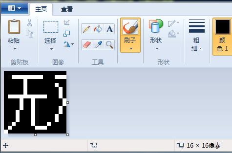

保存，这样第一个分隔字模就完成了，依次分隔后面两个字模

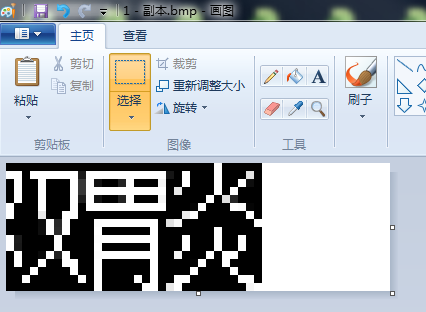

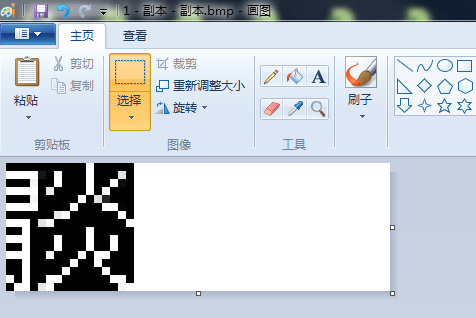
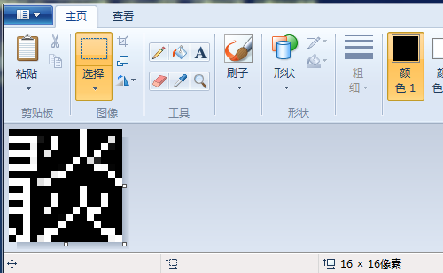
 
全部保存好，这样就得到3个字模，但是内容为4个字【无双胃炎】

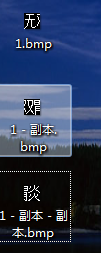

然后进入编辑器正常使用导入字模即可。
